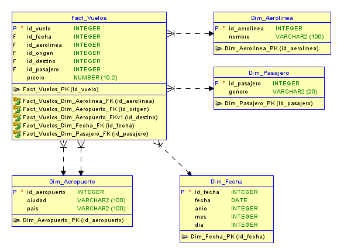

# Práctica 1 – ETL con Python

## Descripción

Se implementó un proceso ETL (Extract, Transform, Load) utilizando Python para extraer, transformar y cargar datos de vuelos hacia un modelo multidimensional en Microsoft SQL Server.

El objetivo fue construir un Data Warehouse con esquema estrella, permitiendo realizar consultas analíticas eficientes.
## Tecnologías utilizadas

Python 3.11

Pandas

SQLAlchemy

PyODBC

Microsoft SQL Server

Oracle SQL Developer Data Modeler

## Modelo de Datos

Se implementó un modelo estrella compuesto por:

- Fact_Vuelos
- Dim_Fecha
- Dim_Aerolinea
- Dim_Aeropuerto
- Dim_Pasajero

La tabla de hechos almacena el precio del ticket como métrica principal.

## Proceso ETL

1. Extracción del archivo CSV.
2. Limpieza y eliminación de duplicados.
3. Transformación de fechas con formatos mixtos.
4. Creación de columnas derivadas (año, mes, día).
5. Carga de dimensiones.
6. Carga de tabla de hechos con relaciones.

## Diagrama del Modelo Estrella 

## Cómo ejecutar

Crear la base de datos en SQL Server.

Ejecutar el script create_tables.sql.

Verificar conexión en etl.py.

Ejecutar en terminal:

python etl.py

##  consultas 

